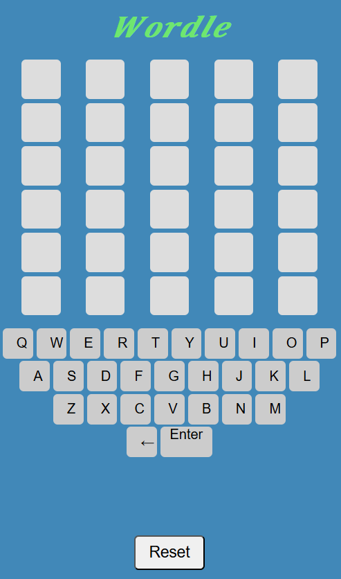

# Wordle

This is a Wordle game that is currently set for 5 letter words and up to 6 chances to win.

# Usage
1. First you enter a five-letter word in the input field.
2. Press Enter and it will display if any letters are in the correct spot or if they are in the word.
3. You can observe this by the color-coded feedback.
Green - States that it is the correct letter and the letter is in the correct position.
Yellow - States the letter is in the word but not in the correct position.
Gray - States the letter is not in the word.
4. You can continue guessing until you find the correct word or run out of attempts. (up to 6 attempts)

#  Github Repo
https://github.com/Lindseyt75/Wordle.git

# Installation
1. if you would like you can clone the repo and then follow the next steps.
2. Open the terminal and add the following commands.
3. npm i
4. npm install react
5. npm run build
6. npm run dev
7. Then press CTRL and click on the link.
8. The game will open and you can have fun!

# License
This project is licensed under the MIT License - see the LICENSE file for details.

# Deployed Link
